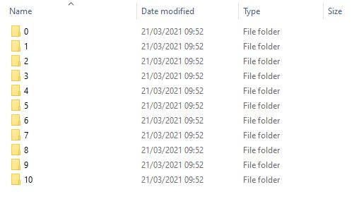
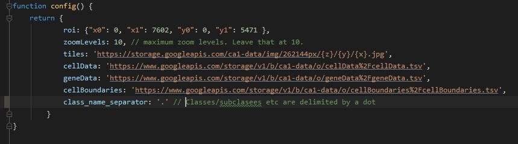
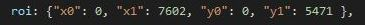
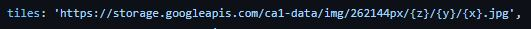

# Visage
An interactive web-based viewer to visualise 2D spatial transcriptomics data. A demo using 
CA1 data from [Qian, X., et al. Nature Methods (2020)](https://www.nature.com/articles/s41592-019-0631-4) runs
 [here](https://acycliq.github.io/ca1/)


## Instructions
You can feed your own data, cell typed or not; Please read below for more details

#### 1. Introduction
Download/clone the master branch from this repo. All the necessary code will be under the `\viewer\js\` directory. 
No extra installations are needed to run the viewer (apart from maybe Python solely for the purpose of running a webserver. 
However, you will need Python too run pciSeq and produce the data that will be consumed by the viewer). You can also use `github-pages` to host the website and make your findings
available to a wider audience.

As a sanity check your local copy of the code should run fine if you open `index.html` that you will 
find under the root folder. Note that we need to serve the root directory (hence the need for Python) 
but most modern IDEs do that automatically behind the scenes    

Then there are three main steps:
 * Prepare the background image
 * Save you data in the correct form so they can be digested by the viewer
 * Set the color scheme of your choice for the genes and cells
 
#### 2. Tiling the background image
As a backgound, in most casecan see that path in the configus we will be a showing a dapi stain. We should have the original image in a tif, jpg, png etc format which will 
be processed to produce a nested directory tree of thousands of small 256px-by-256px jpg files called `map tiles`. At any given zoom level 
the viewer (or to be precise, [leaflet.js](www.leaflet.js)) fetches the necessary tiles and aligns them on the screen making a mosaic that looks 
to the user as a big single image when in reality it is a collation of small ones. 
Read [here](https://en.wikipedia.org/wiki/Tiled_web_map), [here](https://docs.microsoft.com/en-us/azure/azure-maps/zoom-levels-and-tile-grid?tabs=csharp) and
[here](https://www.e-education.psu.edu/geog585/node/706) for more details on tiled maps

Install `pciSeq` via `pip install pciSeq` and call the `tile_maker` function. Set the `z-depth` parameter to `10` despite the fact that in several cases this will be an overkill. Ten zoom levels will be needed for very big images, like 
full coronal slices, otherwise eight levels, or even six, will be fine. However setting `z-depth = 10` will simplify the process of adopting the code and use it with your 
own data especially if you do this for the first time. 
The rest of the arguments are self-explanatory. A typical example will look like:

```python
import pciSeq

pciSeq.tile_maker(z_value, path\to\target\dir, path\to\dapi_image.tif)
```

For `z_value = 10` as recommended, this operation on my Intel i7 Windows 10 PC takes about 1h:15mins to complete

Note that you have to install the [libvips binary](https://libvips.github.io/libvips/install.html). If this is missing the `tile_maker()` 
will not be exposed by `pciSeq` and you will get the following message if you try to call it: `AttributeError: module 'pciSeq' has no attribute 'tile_maker'`
 
If you are using Linux and for some reason `libvips` is missing then the following commands should help:
   
    apt-get update
    apt-get upgrade
    apt-get install libvips
    pip install pyvips

If you are on Windows get the `libvips` executable and then add it to your `PATH`

When `tile_maker` finishes it should have created a big directory tree of nested folders that at its top level will look like the screenshot below:

<!--

Fig:1 Nested directory tree


<figure>
  
  <figcaption>This is my caption text.</figcaption>
</figure>
-->

|  | 
|:--:| 
| *Fig:1 Nested directory tree* |


Each of the these folders corresponds to a zoom level and contain all the necessary tiles as 256px-by-256px small jpg files that can reproduce the background image for that given level.

#### 3. Viewer flat files
The viewer needs three text flat files:
* cellData.tsv
* geneData.tsv
* cellBoundaries.tsv

These can be produced directly from the `fit()` method of `pciSeq` if you set the `save_data` argument to `True`:
 
        import pciSeq

        opts = {'save_data': True}
        res = pciSeq.fit(spots_df, label_image, scRNA_df, opts)
This will make a folder named `pciSeq` in your system's TEMP directory where the three tsv files will be saved when the `fit()` method finishes.


#### 4. Storing the data
Store the data (the tsv flatfiles but also the JPGs for the map tiles) on Google Cloud Storage. In most cases you will stay within the free quota or 
maybe get charged with a tiny fee but please monitor your usage to avoid unpleasant surprises. 

When moving the map tiles to google cloud storage do not move anything that corresponds to `z=9` and `z=10` (ie the last two folders in the directory tree shown in Fig:1).
These are very big folders containing thousands and thousands of files but it is very unlikely they will be of any use unless you have a full coronal slice.

I would also suggest to make the Google Cloud Storage bucket public, otherwise you will have to set the permissions appropriately.


#### 5. Configuration
You have now saved your data. To visualise them you need to tell the viewer where to look for them. This task is handled by the file
[config.js](https://github.com/acycliq/ca1/blob/main/viewer/js/config.js) also show in the image below:


##### 5.1 Image dimensions:
Use the line:



to input the dimensions of your image. Leave `x0` and `y0` to zero and set `x1`, `y1` equal to the width and height (in pixels) respectively of your image.

##### 5.2 Map tiles:
In my Google Cloud Storage I have created a public bucket called `ca1-data` with a folder `img` and its subfolder `262144px`. Hence the path is `ca1-data/img/262144px` and 
this is the location where the directory tree structure (see Fig:1) has been uploaded. You can see that path in the configuration file [config.js](https://github.com/acycliq/ca1/blob/main/viewer/js/config.js)
in the line that sets the tiles' location:



Change this path to match your data and bucket setup but leave the `/{z}/{y}/{x}.jpg` part unchanged in your `config.js`. As a sanity check, if you replace it with  `/0/0/0.jpg`, ie effectively making the link
`https://storage.googleapis.com/ca1-data/img/262144px/0/0/0.jpg`, then this link should be a live link pointing to a jpg; In my case it gives [this](https://storage.googleapis.com/ca1-data/img/262144px/0/0/0.jpg).
If this link, appropriately changed to accommodate your data doesnt return anything when used in a browser, then something has been set wrong.

##### 5.2 Flat files:
These are set in a similar manner to the map tiles. You upload the tsv files somewhere in your bucket and then you have to point the configuaration file to that folder in the cloud. 
In general the link has the form:

`https://www.googleapis.com/storage/v1/b/<bucket_name>/o/<path_to_tsv>`

For example I
uploaded `cellData.tsv` inside a folder called `cellData` and my bucker name is `ca1-data`, hence the link is: `https://www.googleapis.com/storage/v1/b/ca1-data/o/cellData/cellData.tsv`.
However the urls for the tsv files should be encoded and in practice this means that any `/` inside the `<path_to_tsv>` part should be replaced by `%2F`. Therefore the link you need to
set in [config.js](https://github.com/acycliq/ca1/blob/main/viewer/js/config.js) becomes:

`https://www.googleapis.com/storage/v1/b/ca1-data/o/cellData%2FcellData.tsv`

For `geneData.tsv` and `cellBundaries.tsv` the logic is the same.
#### 4. Color schemes
TBA


